# Dolfin

A personal finance web app that connects to your bank accounts through Plaid and turns the raw data into a dashboard of spending trends, recurring payments, budgets, and net worth.

Built with React, TypeScript, Node.js/Express, and SQL Server, with Auth0 for login and Plaid for bank data.

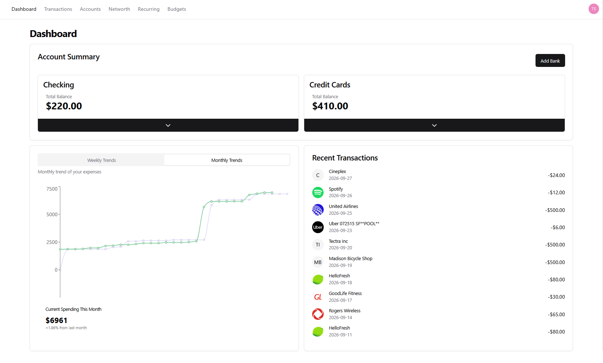

## Features

- **Bank linking with Plaid.** Connect accounts from any Plaid supported institution. Access tokens are exchanged and stored on the server; accounts and transactions are synced into SQL Server.
- **Dashboard.** Checking and credit card balances at a glance, weekly and monthly spending trends compared against the previous period, and a feed of recent transactions.
- **Transactions.** A sortable, filterable, paginated table of every transaction across all linked accounts.
- **Recurring payments.** Subscriptions and bills due in the next 7 days and later, with a calendar that highlights upcoming due dates.
- **Net worth.** Assets and liabilities over time (daily, weekly, monthly), a breakdown by account, and support for adding assets manually.
- **Budgets.** Set budgets and track income and bills.
- **Secure login.** Auth0 handles sign in on the client, and every API request is validated with a JWT on the server.

## Screenshots

### Dashboard

<table>
  <tr>
    <td>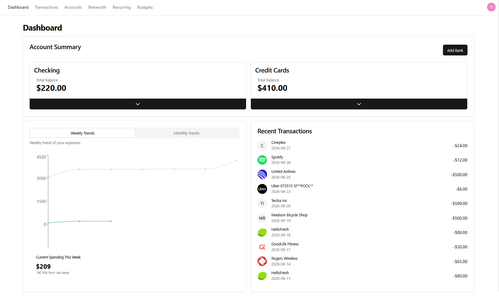</td>
    <td></td>
  </tr>
  <tr>
    <td align="center">Weekly trends</td>
    <td align="center">Monthly trends</td>
  </tr>
</table>

### Transactions

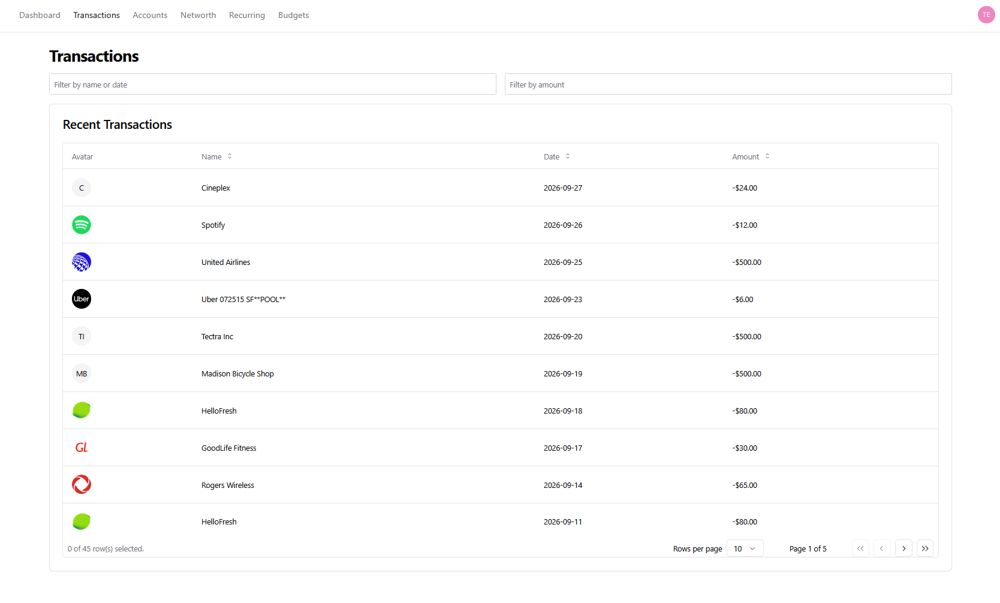

### Accounts

Linked accounts grouped by type, with edit mode for removing an account. Two sandbox institutions are linked here, which is why the same Plaid test accounts appear twice.

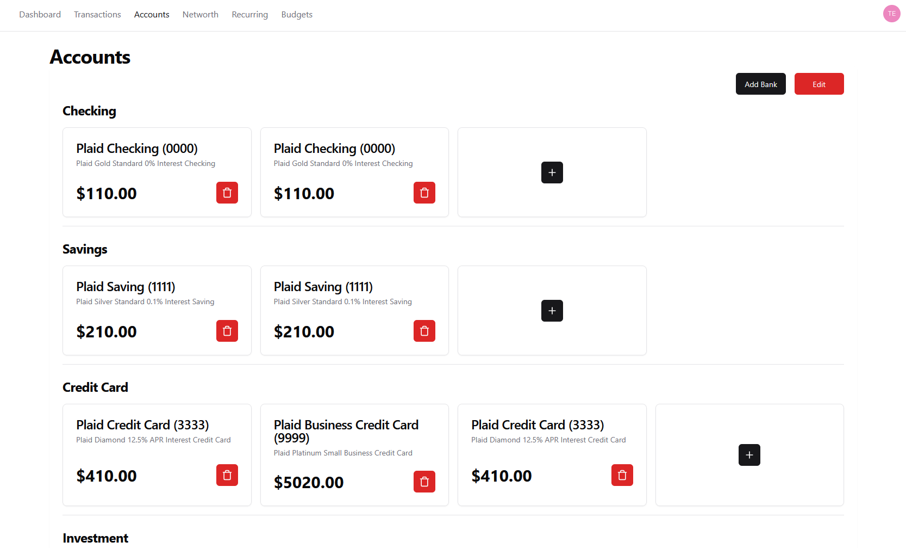

### Recurring payments

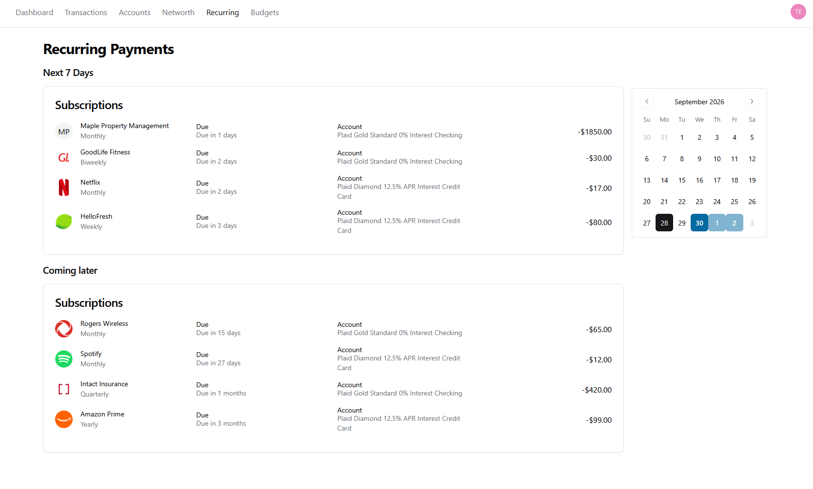

### Net worth

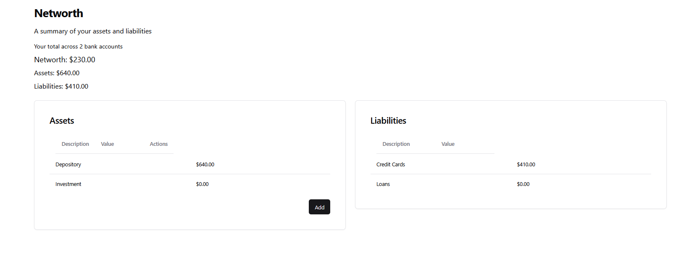

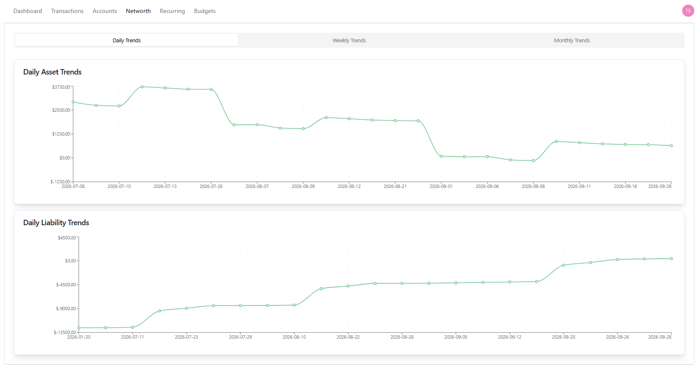

<table>
  <tr>
    <td>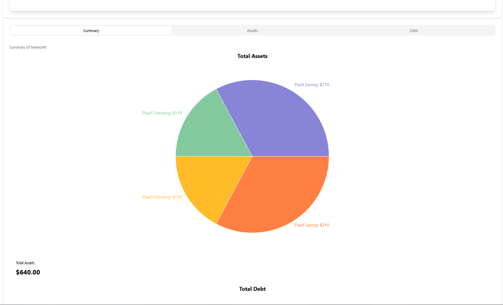</td>
    <td>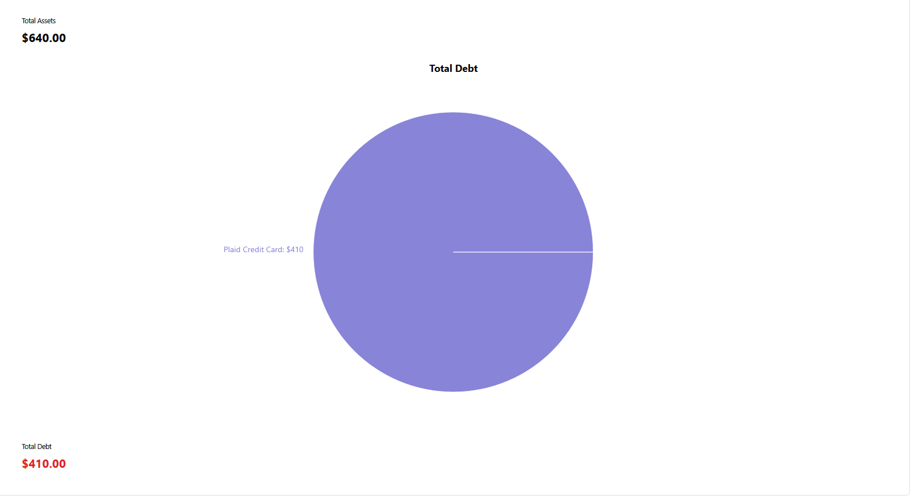</td>
  </tr>
  <tr>
    <td align="center">Assets by account</td>
    <td align="center">Debt by account</td>
  </tr>
</table>

### Sign in and bank linking

<table>
  <tr>
    <td>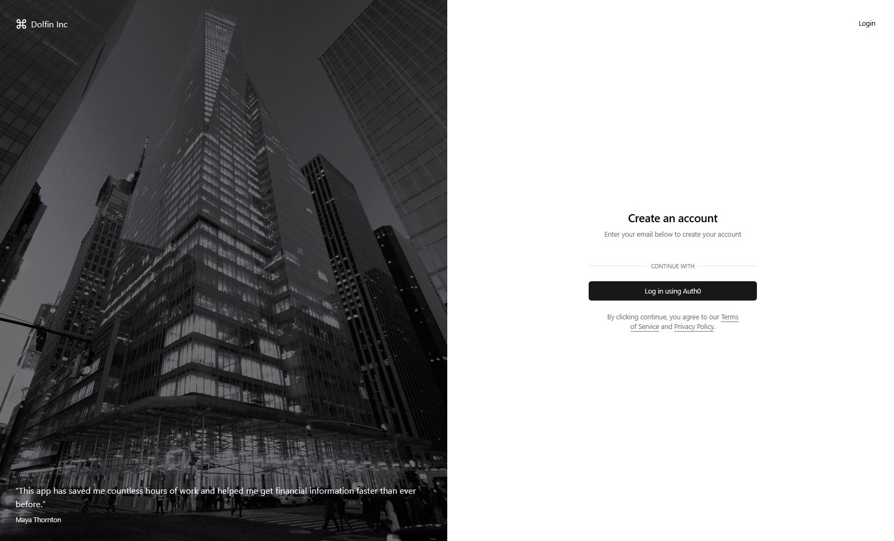</td>
    <td>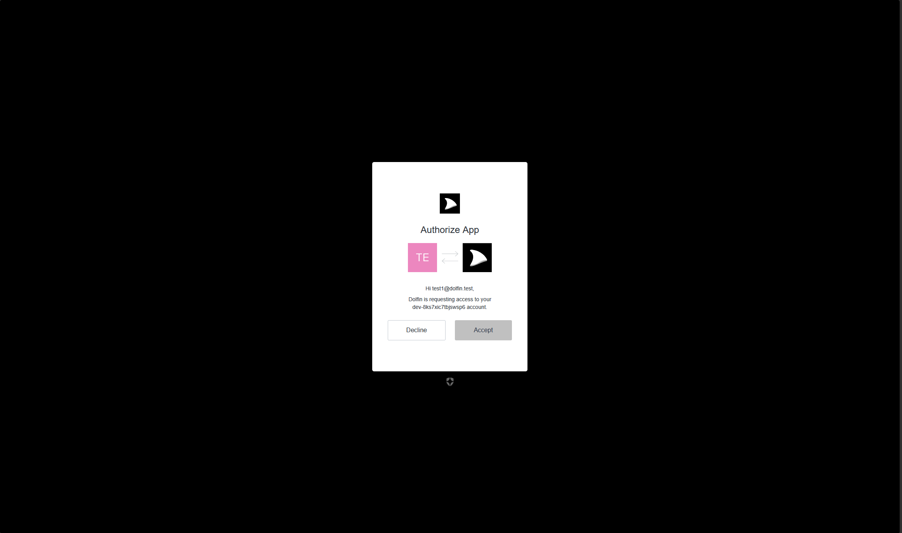</td>
  </tr>
  <tr>
    <td align="center">Landing page</td>
    <td align="center">Auth0 login</td>
  </tr>
</table>

<details>
<summary><b>Plaid Link flow (click to expand)</b></summary>
<br>

| 1. Start | 2. Choose institution | 3. Log in |
|:---:|:---:|:---:|
| 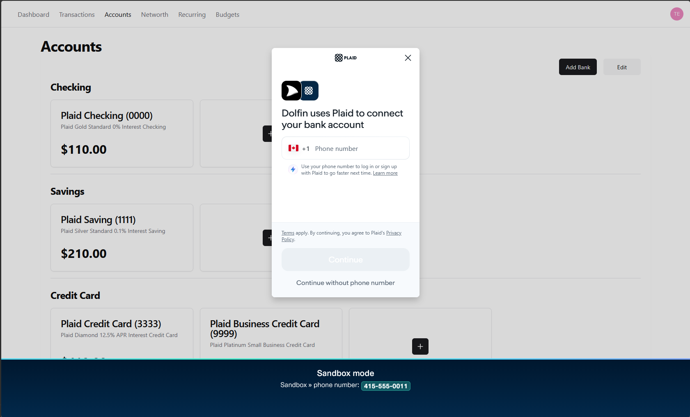 | 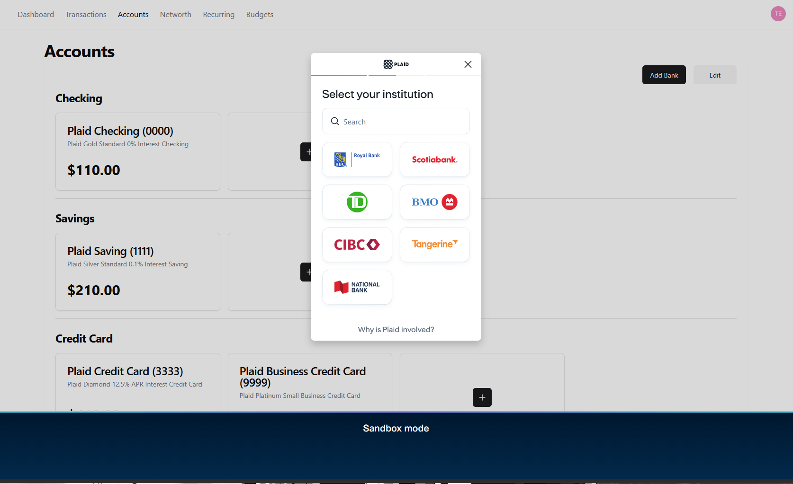 | 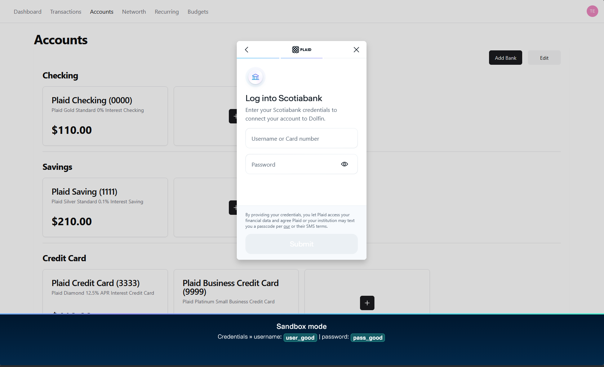 |

| 4. Select accounts | 5. Finish |
|:---:|:---:|
| 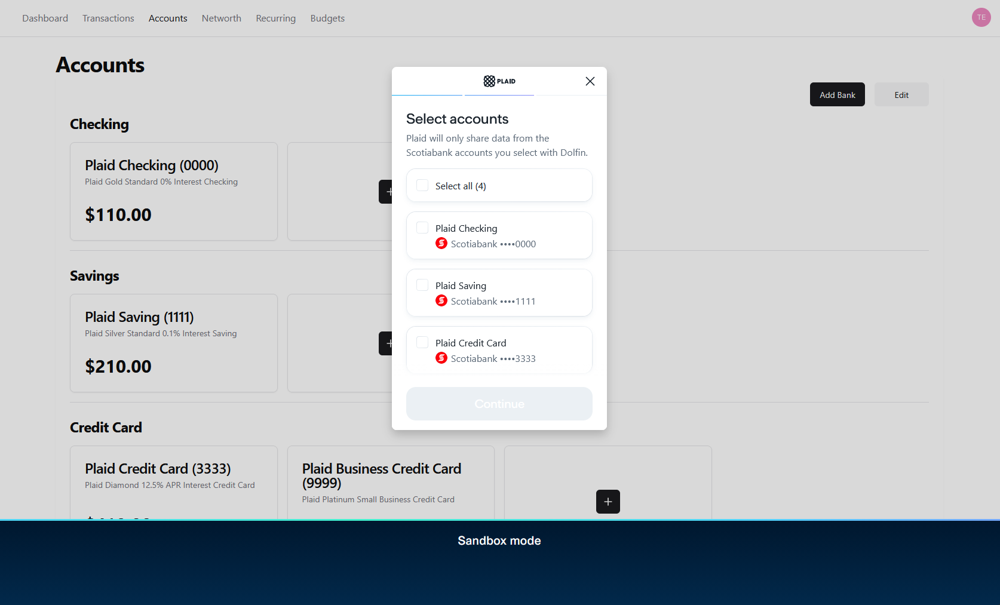 | 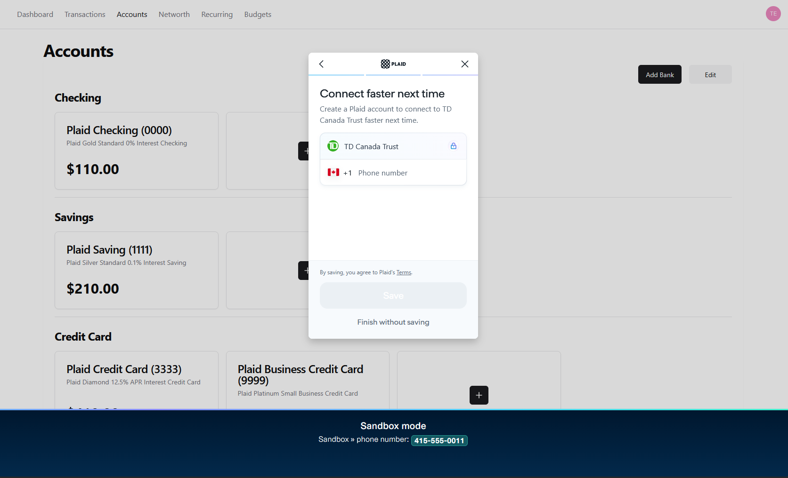 |

</details>

## Tech stack

| Layer | Tools |
|---|---|
| Frontend | React 18, TypeScript, Vite, Tailwind CSS, shadcn/ui (Radix), Material UI, TanStack Table, Recharts, Highcharts |
| Backend | Node.js, Express, Socket.IO |
| Database | Microsoft SQL Server |
| Integrations | Plaid (Link, Transactions), Auth0 |
| CI | GitHub Actions (spins up SQL Server and runs the schema script) |

## Architecture

```
React client (Vite)  ──  Auth0 access token  ──▶  Express API (:8000)  ──▶  SQL Server
       │                                              │
       └── Plaid Link (public token) ─────────────────┴──▶  Plaid API (token exchange, transactions)
```

1. The user signs in with Auth0. The client attaches the access token to every API call, and the server validates it.
2. The user connects a bank with Plaid Link. The server exchanges the public token for an access token and stores the item and its accounts.
3. The server pulls transactions from Plaid and writes them to SQL Server. The client reads everything through the Express API.

## Getting started

### Prerequisites

- Node.js 20+
- SQL Server (the Docker image works well: `mcr.microsoft.com/mssql/server:2022-latest`)
- A [Plaid](https://dashboard.plaid.com/) account with sandbox keys
- An [Auth0](https://auth0.com/) tenant with a Single Page Application and an API

### 1. Set up the database

```bash
docker run -e "ACCEPT_EULA=Y" -e "MSSQL_SA_PASSWORD=<your-password>" -p 1433:1433 -d mcr.microsoft.com/mssql/server:2022-latest

sqlcmd -S localhost -U sa -P '<your-password>' -i db/init_db.sql
# Optional sample data
sqlcmd -S localhost -U sa -P '<your-password>' -d DolfinDB -i db/tests/dummy_data.sql
```

### 2. Configure and start the server

Create `server/.env`:

```env
# Plaid
PLAID_ENV=sandbox
PLAID_CLIENT_ID=
PLAID_SECRET_SANDBOX=
PLAID_SANDBOX_REDIRECT_URI=http://localhost:5173/accounts   # also add under Allowed redirect URIs in the Plaid dashboard

# SQL Server
SQL_SERVER=localhost
SQL_PORT=1433
SQL_DATABASE=DolfinDB
SQL_USER=sa
SQL_PASSWORD=

# Auth0
AUTH0_DOMAIN=your-tenant.us.auth0.com
AUTH0_AUDIENCE=

FRONTEND_URL=http://localhost:5173
```

```bash
cd server
npm install
npm run server   # http://localhost:8000
```

### 3. Configure and start the client

Create `client/.env`:

```env
VITE_AUTH0_DOMAIN=your-tenant.us.auth0.com
VITE_AUTH0_CLIENT_ID=
VITE_AUTH0_AUDIENCE=
VITE_AUTH0_CALLBACK_URL=http://localhost:5173/auth
```

```bash
cd client
npm install
npm run dev      # http://localhost:5173
```

### 4. Link a sandbox bank

In Plaid Link, pick any institution and sign in with the sandbox credentials:

- Username: `user_good`
- Password: `pass_good`
- Phone (if asked): `415-555-0011`

## Team

Built by a team of three. Originally developed at [Amanuel-Negussie/Dolfin](https://github.com/Amanuel-Negussie/Dolfin).
